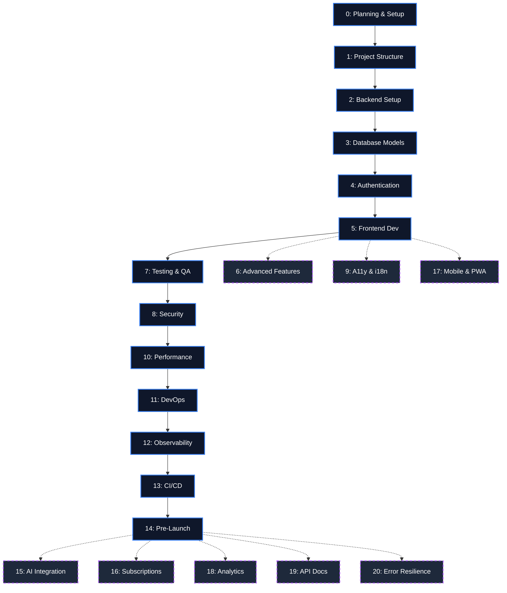

# 🚀 Next.js Full-Stack Development Workflows

[](https://nextjs.org/)
[](https://react.dev/)
[](https://tailwindcss.com/)
[](https://opensource.org/licenses/MIT)

A comprehensive, phase-gated **AI prompt library** for building production-grade Next.js applications. Each phase contains ready-to-use prompts designed for AI coding assistants (Claude Code, Cursor, GitHub Copilot) that guide you from initial idea to post-launch resilience.

> **21 phases · 100+ prompts · 2025–2026 stack**

---

## 📋 Quick Start

### Use in a New or Existing Project

```bash
# Clone into your project
git clone https://github.com/<your-username>/nextjs-workflows.git workflows

# Or add as a subtree to track updates
git subtree add --prefix=workflows https://github.com/<your-username>/nextjs-workflows.git main
```

Then reference the prompts from `workflows/phases/` when working with your AI assistant.

### How It Works

1. **Start at Phase 0** — follow phases sequentially
2. **Copy prompts into your AI assistant** — each `Prompt X.Y` block is ready to paste
3. **Fill in `[bracketed]` placeholders** with your project specifics
4. **Follow the phase's deliverables** — each phase lists what should be produced

---

## 🗂️ Phases

### 🗺️ Visual Workflow



### 🧭 Which Phase Do I Need?

**Starting a new project?**
Begin firmly at **Phase 0** and proceed sequentially through **Phase 5**. These are the critical path foundations for every Next.js application.

**Need secure user logins?**
Jump to **Phase 4 (Authentication)** to see patterns for Auth.js, Clerk, and Better Auth.

**App is slow? Need better Core Web Vitals?**
You need **Phase 10 (Performance Optimization)** for caching strategies, bundle analysis, and image optimization.

**Deploying to production tomorrow?**
Pause development and run through **Phase 14 (Pre-Launch Checklist)**, **Phase 8 (Security)**, and **Phase 12 (Observability)** immediately.

**Adding new revenue streams or paid plans?**
Head straight to **Phase 16 (Payment & Subscription)** for Stripe integration and webhooks.

**Trying to add ChatGPT-like features?**
Use **Phase 15 (AI & LLM Integration)** for Vercel AI SDK integration, RAG pipelines, and tool calling.

**Want AI to design your UI before you code?**
Use **Phase 0.8 (Google Stitch)** to generate high-fidelity screens and a `DESIGN.md` design system from natural language prompts.

### Phase Directory

| # | Phase | Role | Description |
|---|---|---|---|
| 0 | [Planning & Setup](phases/PHASE_0_PLANNING__SETUP_Product_Manager_UIUX_Designer.md) | Product Manager, UI/UX Designer | Ideation, PRD, tech design, wireframes, **Google Stitch**, design system |
| 1 | [Project Structure & Config](phases/PHASE_1_PROJECT_STRUCTURE__CONFIGURATION_Full-Stack_Developer.md) | Full-Stack Developer | Project init, `next.config.ts`, Biome, Tailwind v4 |
| 2 | [Backend: API Routes & Server Actions](phases/PHASE_2_BACKEND_SETUP_API_Routes__Server_Actions.md) | Full-Stack Developer | Route Handlers, Server Actions, validation |
| 3 | [Database Models & Integration](phases/PHASE_3_DATABASE_MODELS__INTEGRATION_Database_Architect.md) | Database Architect | Schema design, Prisma/Drizzle, migrations |
| 4 | [Authentication & Authorization](phases/PHASE_4_AUTHENTICATION__AUTHORIZATION_Security_Expert.md) | Security Expert | Auth flow, OAuth, session management |
| 5 | [Frontend Development](phases/PHASE_5_FRONTEND_DEVELOPMENT_Frontend_Developer.md) | Frontend Developer | Components, layouts, forms, state |
| 6 | [Advanced Features](phases/PHASE_6_ADVANCED_FEATURES_Full-Stack_Developer.md) | Full-Stack Developer | PPR, streaming, intercepting routes |
| 7 | [Testing & QA](phases/PHASE_7_TESTING_QA__Testing_Engineer.md) | Testing Engineer | Vitest, Playwright, coverage |
| 8 | [Security & Automation](phases/PHASE_8_SECURITY_AUTOMATION_DevSecOps.md) | DevSecOps | Headers, CSP, rate limiting, scanning |
| 9 | [Accessibility & i18n](phases/PHASE_9_ACCESSIBILITY__INTERNATIONALIZATION_UIUX_Designer_Frontend_Developer.md) | UI/UX, Frontend | WCAG 2.2, RTL, locales, reduced motion |
| 10 | [Performance Optimization](phases/PHASE_10_PERFORMANCE_OPTIMIZATION_Frontend_Backend_DevOps.md) | Frontend, Backend, DevOps | Caching, bundle analysis, image opt |
| 11 | [DevOps & Infrastructure](phases/PHASE_11_DEVOPS__INFRASTRUCTURE_DevOps_Engineer.md) | DevOps Engineer | Infra, CDN, edge, databases |
| 12 | [Observability & Monitoring](phases/PHASE_12_OBSERVABILITY__MONITORING_DevOps_SRE.md) | DevOps, SRE | Logging, tracing, alerting |
| 13 | [Deployment & CI/CD](phases/PHASE_13_DEPLOYMENT__CICD_DevOps_Engineer.md) | DevOps Engineer | GitHub Actions, preview deploys |
| 14 | [Pre-Launch Checklist](phases/PHASE_14_PRE-LAUNCH_CHECKLIST_All_Roles.md) | All Roles | Final checks before go-live |
| 15 | [AI & LLM Integration](phases/PHASE_15_AI__LLM_INTEGRATION_AI_Engineer.md) | AI Engineer | Vercel AI SDK, tool calling, RAG |
| 16 | [Payment & Subscription](phases/PHASE_16_PAYMENT__SUBSCRIPTION_SYSTEM_Full-Stack_Engineer.md) | Full-Stack Engineer | Stripe, webhooks, billing portal |
| 17 | [Mobile & PWA](phases/PHASE_17_MOBILE__PWA_Frontend_Engineer.md) | Frontend Engineer | Manifest, offline, install prompts |
| 18 | [Analytics & Feature Flags](phases/PHASE_18_ANALYTICS__FEATURE_FLAGS_Product_Engineer.md) | Product Engineer | PostHog (consent-gated), flags |
| 19 | [API Documentation & Versioning](phases/PHASE_19_API_DOCUMENTATION__VERSIONING_Backend_Engineer.md) | Backend Engineer | Scalar, OpenAPI, SDK generation |
| 20 | [Error Handling & Resilience](phases/PHASE_20_ERROR_HANDLING__RESILIENCE_Full-Stack_Engineer.md) | Full-Stack Engineer | AppError class, retries, fallbacks |

---

## 🛠️ Target Tech Stack

| Category | Technology |
|---|---|
| **Framework** | Next.js 15/16+ (App Router) |
| **React** | 19+ (`useActionState`, `useOptimistic`, `use()`) |
| **Language** | TypeScript (strict) |
| **Node.js** | 22+ |
| **Styling** | Tailwind CSS v4 (`@theme`, `oklch()`) |
| **UI** | shadcn/ui |
| **Database** | PostgreSQL (Neon/Supabase), MongoDB, Convex |
| **ORM** | Prisma / Drizzle |
| **Auth** | Better Auth / Auth.js v5 / Clerk |
| **Email** | Resend + React Email |
| **AI** | Vercel AI SDK (OpenAI, Anthropic) |
| **Design** | Google Stitch (`DESIGN.md`, MCP, SDK) |
| **Payments** | Stripe |
| **Linting** | Biome |
| **Testing** | Vitest + Playwright |
| **Deployment** | Vercel / AWS |
| **CI/CD** | GitHub Actions |
| **Analytics** | PostHog |
| **Bundler** | Turbopack |

---

## 📁 Project Structure

```
phases/
├── PHASE_0_*.md  →  PHASE_20_*.md    # Human-readable prompt files
└── agent_workflows/                    # Agent-executable workflows
    ├── 00-*.md  →  20-*.md            # Step-by-step with YAML front matter
```

### File Naming

- **`PHASE_N_TITLE__ROLE.md`** — Copy-paste prompts with code templates
- **`agent_workflows/N-*.md`** — Structured workflows with prerequisites, steps, file targets, and verification checklists

---

## 🔑 Key Patterns

### PostHog — Consent-Gated Init (Phase 18)

```tsx
// components/consent-banner.tsx
useEffect(() => {
  const consent = getConsent()
  if (consent === 'granted') posthog.init(/* ... */)
  else posthog.opt_out_capturing()
}, [])
```

### Scalar API Docs — Next.js 15+ Import (Phase 19)

```typescript
// app/api/docs/ui/route.ts
import { ApiReference } from '@scalar/nextjs-api-reference'
export const GET = ApiReference({ spec: { url: '/api/docs' } })
```

### AppError Base Class (Phase 20)

```typescript
// lib/errors.ts
export class AppError extends Error {
  constructor(message: string, public code: string, public statusCode = 500) {
    super(message)
    this.name = 'AppError'
  }
}
```

### Google Stitch — DESIGN.md (Phase 0.8)

```markdown
<!-- DESIGN.md — placed at project root -->
# Design System
## Colors
- Primary: oklch(0.7 0.15 250)
- Background: oklch(0.15 0.01 260)
## Typography
- Heading: "Inter", sans-serif, 700
- Body: "Inter", sans-serif, 400
## Spacing
- Base: 4px, Scale: 4/8/12/16/24/32/48/64
```

---

## 🤖 Using with AI Agents

**Claude Code / Cursor / Copilot** — point to a phase file and execute:

```
Read ./phases/PHASE_0_PLANNING__SETUP_Product_Manager_UIUX_Designer.md
and execute Prompt 0.1 for my project.
```

**Automated agents** — use the `agent_workflows/` directory which includes structured steps (`prompt_execution`, `write_to_file`, `review`) with deliverable checklists.

---

## 📄 License

MIT
