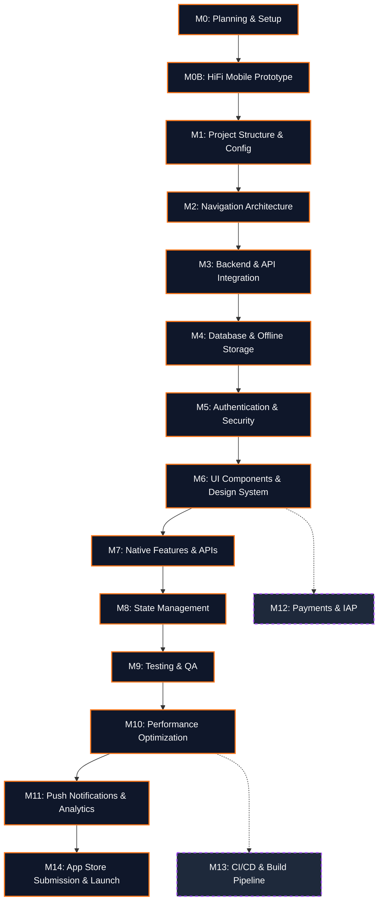

# 📱 Mobile App Development Workflows (React Native / Expo)

[](https://expo.dev/)
[](https://reactnative.dev/)
[](https://www.typescriptlang.org/)
[](./MOBILE_CLAUDE.md)
[](https://opensource.org/licenses/MIT)

A comprehensive, phase-gated **AI prompt library** for building production-grade **React Native / Expo** mobile applications. Enhanced with the **Everything Claude Code (ECC)** agent harness for AI-assisted development. Each phase contains ready-to-use prompts for AI coding assistants (**Google Antigravity**, Claude Code, Cursor, GitHub Copilot).

> **15 phases · 80+ prompts · 8 skills · 7 agents · 5 hooks · iOS & Android**

---

## 📋 Quick Start

```bash
# Clone alongside your mobile project
git clone https://github.com/<your-username>/workflows.git workflows

# Or add as a subtree
git subtree add --prefix=workflows https://github.com/<your-username>/workflows.git main
```

Reference prompts from `workflows/mobile/phases/` when working with your AI assistant.

### How It Works

1. **Start at Phase M0** — follow phases sequentially
2. **Copy prompts into your AI assistant** — each `Prompt M#.#` block is ready to paste
3. **Fill in `[bracketed]` placeholders** with your project specifics
4. **Follow phase deliverables** — each phase lists what should be produced

### 🤖 With ECC Agent Harness (Recommended)

1. **Set up the harness** — Follow **Prompt M0.8** to initialize mobile-specific skills, agents, and hooks
2. **Use agent commands** — `/mobile-planner`, `/rn-reviewer`, `/store-specialist`
3. **Automated quality gates** — Hooks type-check, lint, and test on every edit

---

## 🏗️ Architecture

```
mobile/
├── MOBILE_README.md           # 📖 This file — start here
├── MOBILE_CLAUDE.md           # 🎯 Agent meta-configuration
├── phases/                    # 📋 15-phase mobile workflow
│   ├── MOBILE_PHASE_0_*.md    #    Planning, PRD, Tech Design
│   ├── MOBILE_PHASE_0B_*.md   #    HiFi Mobile Prototype (Stitch)
│   ├── MOBILE_PHASE_1_*.md    #    Project Structure & Config
│   ├── MOBILE_PHASE_2_*.md    #    Navigation Architecture
│   ├── MOBILE_PHASE_3_*.md    #    Backend & API Integration
│   ├── MOBILE_PHASE_4_*.md    #    Database & Offline Storage
│   ├── MOBILE_PHASE_5_*.md    #    Authentication & Security
│   ├── MOBILE_PHASE_6_*.md    #    UI Components & Design System
│   ├── MOBILE_PHASE_7_*.md    #    Native Features & APIs
│   ├── MOBILE_PHASE_8_*.md    #    State Management
│   ├── MOBILE_PHASE_9_*.md    #    Testing & QA
│   ├── MOBILE_PHASE_10_*.md   #    Performance Optimization
│   ├── MOBILE_PHASE_11_*.md   #    Push Notifications & Analytics
│   ├── MOBILE_PHASE_12_*.md   #    Payments & Subscriptions (IAP)
│   ├── MOBILE_PHASE_13_*.md   #    CI/CD & Build Pipeline
│   └── MOBILE_PHASE_14_*.md   #    App Store Submission & Launch
├── agents/                    # 🤖 Mobile-specific ECC agents
│   ├── mobile-planner.md
│   ├── rn-reviewer.md
│   ├── store-specialist.md
│   ├── mobile-security.md
│   ├── performance-profiler.md
│   ├── mobile-tdd-guide.md
│   └── eas-builder.md
├── skills/                    # 🧠 Mobile ECC skills
│   ├── rn-patterns/
│   ├── expo-workflow/
│   ├── store-submission/
│   ├── mobile-security/
│   ├── offline-first/
│   ├── mobile-testing/
│   ├── mobile-performance/
│   └── mobile-verification-loop/
└── hooks/                     # ⚡ Mobile lifecycle hooks
    ├── post-edit-typecheck.json
    ├── post-edit-lint.json
    ├── pre-commit-security.json
    ├── stop-session-save.json
    └── stop-console-audit.json
```

---

## 🗂️ Phases

### 🗺️ Visual Workflow



### 🧭 Which Phase Do I Need?

**Starting a new app?**
Begin at **Phase M0** and proceed sequentially through **Phase M6**. These are the critical path foundations.

**Need navigation patterns?**
Jump to **Phase M2** for Expo Router (file-based) vs React Navigation stack patterns.

**App is laggy? High memory use?**
Use **Phase M10** for FlatList optimization, re-render profiling, and Hermes engine tuning.

**Ready to ship?**
Run through **Phase M14** (App Store / Play Store submission) and **Phase M9** (Testing) immediately.

**Need subscriptions or one-time purchases?**
Head to **Phase M12** for RevenueCat + StoreKit 2 / Google Play Billing integration.

**Want AI to design your mobile UI?**
Use **Phase M0B** to generate high-fidelity mobile screens with Google Stitch (MCP).

### Phase Directory

| # | Phase | Role | Description |
|---|---|---|---|
| M0 | [Planning & Setup](phases/MOBILE_PHASE_0_PLANNING_SETUP_Product_Manager_Mobile_Architect.md) | Product Manager, Mobile Architect | Ideation, PRD, tech design, platform decisions, ECC setup |
| M0B | [HiFi Mobile Prototype](phases/MOBILE_PHASE_0B_HIFI_PROTOTYPE_UI_Designer.md) | UI/UX Designer | Google Stitch mobile screens, design tokens, prototype sign-off |
| M1 | [Project Structure & Config](phases/MOBILE_PHASE_1_PROJECT_STRUCTURE_CONFIGURATION_Full_Stack_Mobile.md) | Full-Stack Mobile Developer | Expo init, `app.json`, EAS config, Biome, path aliases |
| M2 | [Navigation Architecture](phases/MOBILE_PHASE_2_NAVIGATION_ARCHITECTURE_Mobile_Developer.md) | Mobile Developer | Expo Router, tab/stack/drawer, deep links, auth guards |
| M3 | [Backend & API Integration](phases/MOBILE_PHASE_3_BACKEND_API_INTEGRATION_Full_Stack.md) | Full-Stack Developer | REST/GraphQL/tRPC, Axios/Fetch, error handling, retries |
| M4 | [Database & Offline Storage](phases/MOBILE_PHASE_4_DATABASE_OFFLINE_STORAGE_Mobile_Architect.md) | Mobile Architect | SQLite (Drizzle ORM), MMKV, WatermelonDB, sync strategy |
| M5 | [Authentication & Security](phases/MOBILE_PHASE_5_AUTHENTICATION_SECURITY_Security_Expert.md) | Security Expert | OAuth, Biometric, SecureStore, token rotation, Keychain |
| M6 | [UI Components & Design System](phases/MOBILE_PHASE_6_UI_COMPONENTS_DESIGN_SYSTEM_Frontend_Developer.md) | Frontend Developer | NativeWind, Tamagui, animation (Reanimated 3), gesture |
| M7 | [Native Features & APIs](phases/MOBILE_PHASE_7_NATIVE_FEATURES_APIs_Mobile_Developer.md) | Mobile Developer | Camera, Location, Haptics, Notifications, Permissions |
| M8 | [State Management](phases/MOBILE_PHASE_8_STATE_MANAGEMENT_Full_Stack_Mobile.md) | Full-Stack Mobile Developer | Zustand, React Query (TanStack), URL state, Jotai |
| M9 | [Testing & QA](phases/MOBILE_PHASE_9_TESTING_QA_QA_Engineer.md) | QA Engineer | Jest, RNTL, Maestro E2E, Detox, coverage gates |
| M10 | [Performance Optimization](phases/MOBILE_PHASE_10_PERFORMANCE_OPTIMIZATION_Mobile_Developer.md) | Mobile Developer | FlatList, memo, Hermes, bundle size, Flashlight profiling |
| M11 | [Push Notifications & Analytics](phases/MOBILE_PHASE_11_PUSH_NOTIFICATIONS_ANALYTICS_Product_Engineer.md) | Product Engineer | Expo Notifications, OneSignal, PostHog, Firebase Analytics |
| M12 | [Payments & IAP](phases/MOBILE_PHASE_12_PAYMENTS_IAP_Full_Stack_Engineer.md) | Full-Stack Engineer | RevenueCat, StoreKit 2, Google Play Billing, webhooks |
| M13 | [CI/CD & Build Pipeline](phases/MOBILE_PHASE_13_CICD_BUILD_PIPELINE_DevOps_Engineer.md) | DevOps Engineer | EAS Build, EAS Submit, GitHub Actions, OTA updates |
| M14 | [App Store Submission & Launch](phases/MOBILE_PHASE_14_APP_STORE_SUBMISSION_LAUNCH_All_Roles.md) | All Roles | ASO, screenshots, review guidelines, launch checklist |

---

## 🤖 ECC Agent Harness

### Agent Quick Reference

| Command | Agent | Purpose | Phase |
|---------|-------|---------|-------|
| `/mobile-planner` | [Mobile Planner](agents/mobile-planner.md) | Task decomposition for mobile features | M0 |
| `/rn-reviewer` | [RN Reviewer](agents/rn-reviewer.md) | React Native code quality review | All |
| `/store-specialist` | [Store Specialist](agents/store-specialist.md) | App Store & Play Store submission | M14 |
| `/mobile-security` | [Mobile Security](agents/mobile-security.md) | Mobile security audit | M5, M14 |
| `/performance-profiler` | [Perf Profiler](agents/performance-profiler.md) | FPS, memory, bundle size analysis | M10 |
| `/mobile-tdd-guide` | [Mobile TDD Guide](agents/mobile-tdd-guide.md) | Jest + Maestro TDD workflow | M9 |
| `/eas-builder` | [EAS Builder](agents/eas-builder.md) | EAS Build/Submit automation | M13 |

### Skills

| Skill | Description | Used By |
|-------|-------------|---------|
| [rn-patterns](skills/rn-patterns/SKILL.md) | React Native architecture patterns | RN Reviewer |
| [expo-workflow](skills/expo-workflow/SKILL.md) | Expo SDK, EAS, OTA update workflow | EAS Builder |
| [store-submission](skills/store-submission/SKILL.md) | App Store & Play Store guidelines | Store Specialist |
| [mobile-security](skills/mobile-security/SKILL.md) | SecureStore, biometrics, certificate pinning | Mobile Security |
| [offline-first](skills/offline-first/SKILL.md) | SQLite sync, optimistic updates, conflict resolution | Mobile Planner |
| [mobile-testing](skills/mobile-testing/SKILL.md) | Jest + RNTL + Maestro E2E | Mobile TDD Guide |
| [mobile-performance](skills/mobile-performance/SKILL.md) | FlatList, Reanimated, Hermes | Performance Profiler |
| [mobile-verification-loop](skills/mobile-verification-loop/SKILL.md) | 5-gate mobile quality pipeline | All Agents |

### Hooks (Automated Lifecycle Events)

| Hook | Event | Effect |
|------|-------|--------|
| [post-edit-typecheck](hooks/post-edit-typecheck.json) | After file edit | Run `tsc --noEmit` |
| [post-edit-lint](hooks/post-edit-lint.json) | After file edit | Auto-lint with Biome/ESLint |
| [pre-commit-security](hooks/pre-commit-security.json) | Before file write | Block hardcoded secrets & API keys |
| [stop-session-save](hooks/stop-session-save.json) | Session end | Persist session state |
| [stop-console-audit](hooks/stop-console-audit.json) | Session end | Flag `console.log` statements |

---

## 🛠️ Target Tech Stack

| Category | Technology |
|---|---|
| **Framework** | Expo SDK 52+ (Managed Workflow) |
| **React Native** | 0.76+ (New Architecture — Fabric + JSI) |
| **Language** | TypeScript (strict) |
| **Navigation** | Expo Router 4+ (file-based) |
| **Styling** | NativeWind v4 (Tailwind for RN) / Tamagui |
| **Animation** | React Native Reanimated 3 / Skia |
| **Gestures** | React Native Gesture Handler |
| **State** | Zustand + TanStack Query (React Query) |
| **Local DB** | Expo SQLite + Drizzle ORM |
| **Key-Value** | MMKV (`react-native-mmkv`) |
| **Auth** | Expo SecureStore + Biometrics + OAuth |
| **Backend** | Supabase / Convex / custom API |
| **Payments** | RevenueCat (StoreKit 2 / Google Play) |
| **Push** | Expo Notifications / OneSignal |
| **Analytics** | PostHog / Firebase Analytics |
| **Testing** | Jest + React Native Testing Library + Maestro |
| **CI/CD** | EAS Build + EAS Submit + GitHub Actions |
| **Linting** | Biome / ESLint (expo config) |
| **Design** | Google Stitch (MCP) — mobile device type |

---

## 🔑 Key Mobile Patterns

### Expo Router — Typed Routes

```typescript
// app/(tabs)/profile.tsx
import { Link, useLocalSearchParams } from 'expo-router'

export default function ProfileScreen() {
  const { userId } = useLocalSearchParams<{ userId: string }>()
  return <Link href={`/users/${userId}/settings`}>Settings</Link>
}
```

### MMKV — Ultra-Fast Key-Value Storage

```typescript
import { MMKV } from 'react-native-mmkv'
export const storage = new MMKV({ id: 'app-storage' })

// Read/write synchronously (no async/await)
storage.set('onboarded', true)
const onboarded = storage.getBoolean('onboarded')
```

### Zustand + TanStack Query — State Architecture

```typescript
// stores/auth.ts
const useAuthStore = create<AuthState>()(
  persist(
    (set) => ({ user: null, setUser: (user) => set({ user }) }),
    { storage: createJSONStorage(() => MMKVStorage) }
  )
)
```

### Reanimated 3 — Performant Animations

```typescript
const opacity = useSharedValue(0)
const animatedStyle = useAnimatedStyle(() => ({
  opacity: withTiming(opacity.value, { duration: 300 }),
}))
// Runs on the UI thread — zero JS bridge crossings
```

### Google Stitch MCP — Mobile Design Generation

```text
// Generate mobile screens via MCP Stitch tool with device type: MOBILE
// Use the IDEA + THEME + CONTENT formula
// Always specify mobile-specific constraints: safe areas, gesture navigation,
// thumb-zone optimization, platform conventions (iOS vs Android)
```

---

## 🤖 Using with AI Agents

### Google Antigravity (Recommended)

```
Read ./mobile/phases/MOBILE_PHASE_0_PLANNING_SETUP_Product_Manager_Mobile_Architect.md
and execute Prompt M0.1 for my mobile app project.
```

### With ECC Agent Harness

```
Read ./mobile/MOBILE_CLAUDE.md for project context, then:
1. /mobile-planner — decompose the first milestone
2. /mobile-tdd-guide — write tests before implementation
3. /verify — run the 5-gate mobile quality pipeline
```

---

## 📚 Documentation

| Document | Description |
|----------|-------------|
| [MOBILE_CLAUDE.md](MOBILE_CLAUDE.md) | Agent meta-configuration — start here for AI agents |
| [phases/](phases/) | All 15 phase prompt files |
| [agents/](agents/) | Mobile-specific ECC agent definitions |
| [skills/](skills/) | Reusable mobile workflow skills |

---

## 📄 License

MIT
